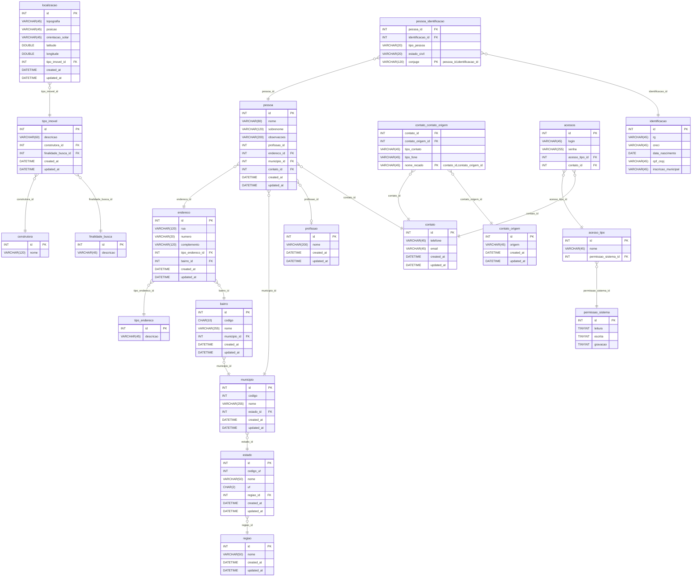

# ERD — Imobiliaria (MySQL)

> Diagrama lógico gerado a partir do script **MySQL Workbench** enviado.  
> Abra este `.md` no GitHub (ou outro renderer) para visualizar o **Mermaid ER diagram**.

---

## 📦 Tabelas & Relacionamentos (Mermaid)

  
---

## 🧭 Observações
- **Mapeamento fiel do SQL**; normalizado nomes apenas para evitar espaços/acentos no diagrama.
- **PKs compostas** marcadas nas entidades dependentes (ex.: `PESSOA`, `IMOBILIARIA`, `TIPO_IMOVEL` e derivadas).
